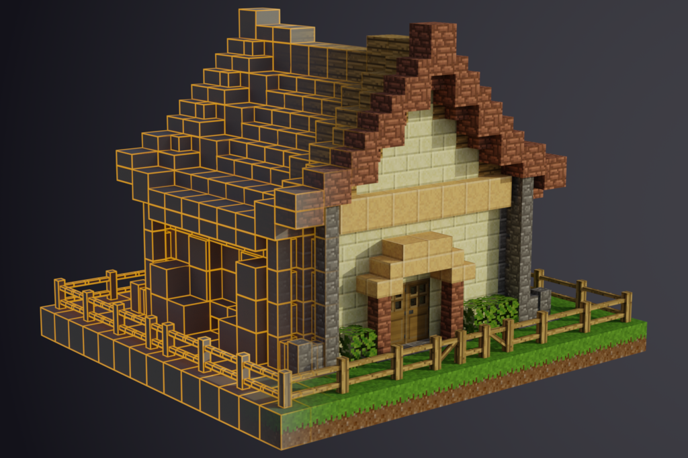

# Meshport (Minetest Mesh Exporter)



Meshport is a mod which allows easy exporting of scenes from Minetest to `.obj` files, complete with materials and textures. These models can be imported directly into Blender or another 3D program for rendering and animation.

This mod is still in the "alpha" phase; as such, many types of nodes are not yet able to be exported. See below for more details.

## Usage

Use `/mesh1` and `/mesh2` to set the corners of the area you want exported, then use `/meshport` to export the mesh. The saved `.obj` and `.mtl` files will be located in the `meshport` folder of the world directory, within a subfolder.

### Importing into Blender

Once the model is exported, you should be able to import the `.obj` file with default settings. Make sure "Image Search" in the import settings is selected to ensure the textures are imported as well. Texture modifiers are ignored, so some materials will likely have to be fixed by hand.

#### Fixing interpolation

If you intend to render the scene, you will want to set the interpolation mode of all the image textures to "Closest" in order to keep the pixelated look. This can either be done manually or by running this script in Blender's text editor:

```python
import bpy

for mat in bpy.data.materials:
    try:
        nodes = mat.node_tree.nodes

        for node in nodes:
            if node.type == "TEX_IMAGE":
                node.interpolation = "Closest"
    except:
        continue
```

#### Fixing vertex normals

Some mesh nodes may not have any vertex normals, which can lead to lighing problems. To fix this, what I have found to work is to first select the all the problematic nodes, either manually or by selecting by material in edit mode; then, mark the selected edges as sharp, and then average the normals by face area.

Additional tip: Use an HDRI sky texture (such as one from [here](https://hdrihaven.com)) for awesome-looking renders. ;)

## Supported features

At the moment, only the following node drawtypes are supported:

- Cubic drawtypes, including `normal`, `glasslike`, `allfaces`, and their variants (see below)
- `nodebox`
- `mesh` (only `.obj` meshes are exported)

Many special rendering features are not yet supported.

### A note on cubic nodes

Due to the differences between Minetest's rendering engine and 3D programs such as Blender, it is not possible to exactly replicate how certain cubic nodes are rendered in Minetest. Instead, to avoid duplicate faces, a face priority system is used as follows:

| Priority level | Drawtypes                                          |
|----------------|----------------------------------------------------|
| 4              | `normal`                                           |
| 3              | `glasslike`                                        |
| 2              | `glasslike_framed` and `glasslike_framed_optional` |
| 1              | `allfaces` and `allfaces_optional`                 |
| 0              | All other nodes                                    |

In places where two nodes of different drawtypes touch, only the face of the node with the higher priority drawtype will be drawn. For `allfaces` type nodes (such as leaves), interior faces will be drawn only when facing X+, Y+, or Z+ in the Minetest coordinate space.

## License

All code is licensed under the GNU LGPL v3.0.
